# GreenTribe

# Web Design Proposal

Sustainable wood growing and forest conservation goes hand in hand. Most of the devastating effects happen in the underdeveloped countries. One might think that local campaigns in a country may not directly affect this hazard. However, one would be entirely wrong. Most of the demand for consumer goods (using ingredients that may in one way or another create deforestation) and wood products which require the destruction of these forests in the underdeveloped countries come from us in the developed countries (Morris 2007).

The aim of this project is to raise awareness among UK consumers which also extends purchasing consumer goods from brands that support sustainable worldwide wood growing. 

As I am located here in London, there are many ways to educate consumers and shift their demands to purchase goods from sustainable sources (Housel 2017).

I’ve chosen a UK organisation “WWF” as the framework for my project. 

 The scope of the website offers content about different aspects of environment and species conservation. To comply with the specifics, the focus will mainly be on the subpage about forest (WWF 2018). However, this will also extend to other pages on the website related to sustainable wood growing and forest conservation efforts.

What strikes me the most is how clean the website looks, how easy it is to navigate around, the appeal of the images, and the just-enough amount of content that is not overwhelming. The setup effectively captures audience’s attention and keeps them engaged while encourages further navigation throughout the website.

The focus:
- benefits of forests both micro and macro
- effects of deforestation on locals and wildlife
- effects of purchasing consumer goods that support deforestation
- how to avoid these effects
Better practice:
- purchase consumer goods from sustainable suppliers. Directories of goods that support forest sustainability (advertising revenue stream)

# Competitive analysis
# # Table 1 – Design, Functionality/Usability
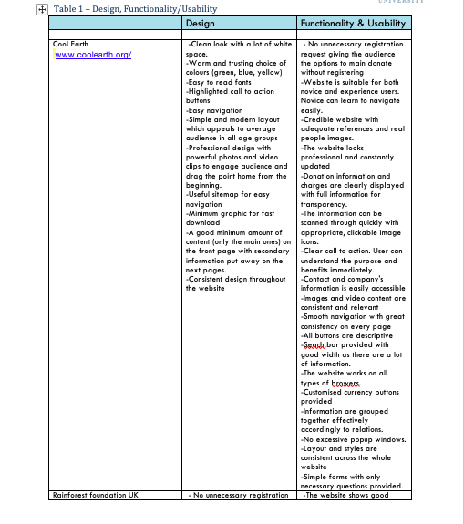
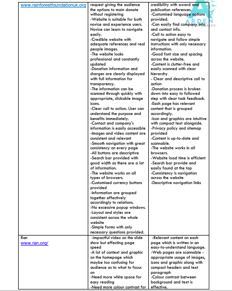
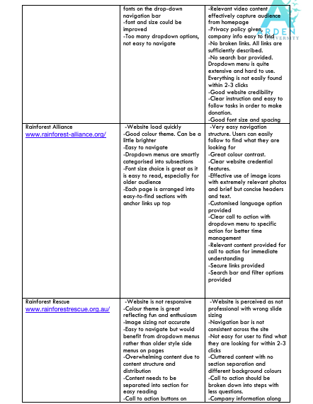
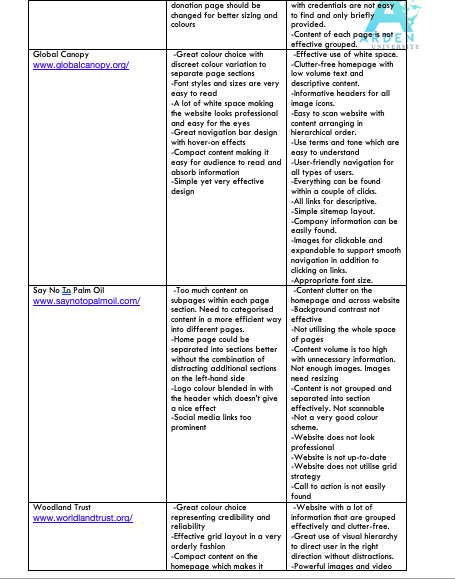
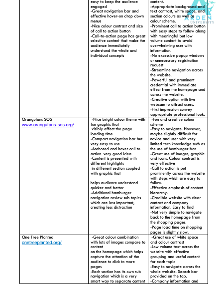
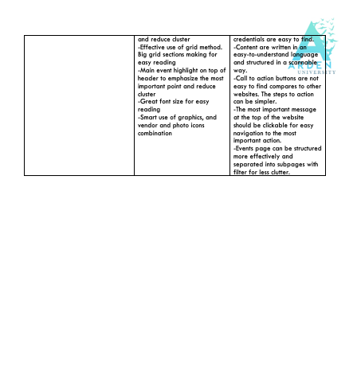

# # Table 2 – Accessibility checklist
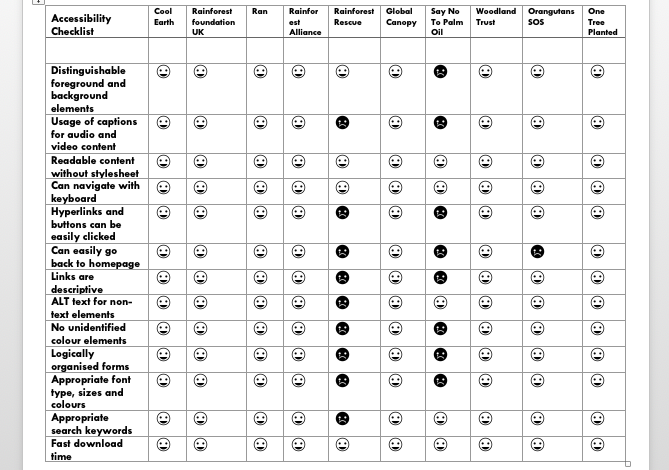

# # Table 2 – Competitive Analysis Summary
Comparison gives us an understanding of what the new website will and won’t include. The most important part is to build a website the has an effective content hierarchyand clutter-free with informative headers that can be easily scanned. The style guide should give a clean and easy-on-the-eye look. The branding must portray a sense of credibility through credentials shown on the website. All links and images should have descriptive captions. Important call-to-action buttons must be prominent across the website. The main navigation bar should exude simplicity to avoid intimidating users which could prohibit them from exploring the website as planned. The navigation process must be streamlined, leading users to the destination with expected commands. Call-to-action forms must be easy to fill without too many questions and must have secure online payment methods. The website should be responsive and displays high quality content on different browsers and devices.
Important aspects to avoid includes using outdated design and overwhelming users with a lot of texts in one section. 

# Web Planning Brief:
# # Background Information
A new website for an existing non-profit organisation. 
# # The goals are:
Within two years
-	To increase environmental awareness within the UK by 25%
-	Increase individual donation total amount by 34%
-	Gain new business partners within the UK by 40%

# # Target Audience
-	Individuals age between 18 – 45 years old with some knowledge of the web technology.
-	Small and medium size businesses operating in the UK market who want to build their social responsibility profile.

# # Content
We are a non-profit organisation focusing on raising fund and building awareness about rehabilitating worldwide rainforest and deforestation with project partners in Latin America, Asia and Africa who have been working with us for the past 8 years.

# # Content to be included:
-	Current situation regarding rainforest destruction around the world and solutions
-	The impact of the crisis 
-	Solutions that we have been supporting and what audience can do to help
-	Donation options and instant online donation for individuals
-	Business contribution options and contact information
-	Photos of current and past projects
-	Team member photos and social links to their bio on social media.
-	Company contact information.
-	Current business partners working with us
-	Privacy policy and terms
-	The content will be provided by the company with alteration by the web developer to strive for Search Engine Optimisation.

# # Call to Action
-	Audience should immediately see a video of deforestation crisis 
-	They should also see call-to-action button “Get involved”
-	The audience should be interested to learn more about what can be done to correct the crisis and eventually donate or become a business partner
-	The two most important call-to-action on the homepage are to “donate” (as an individual) and to “learn more” (as a potential business partner)

# # Social Media and Sharing
-	Target audience spend time on Instagram, Twitter, and Facebook online which requires avenues to share content on these platforms
-	Currently, we have social media presence on all of the platform mentioned

# # Functional Requirements
-	The website will include social media buttons and widget
-	E-commerce capabilities such as customer reviews and special events that they can participate
-	Instant online payment options
-	Area for business partner advertising and sponsorship

# # Design Assets
-	We have existing logo. We will require a style guide and font guide

# # Colour theme
Based on the age group of our audience (generation Y and Z), the colour theme must represent a sense of identity. The theme should feel fun, vibrant yet professional. We will incorporate fresh green, mint, sunshine hue, vermillion, and clean white to the style sheet.  
Design Ideas
-	The design will be based on clutter-free website with a lot of white space and white background. 
-	Colour-theme will portray a fun, unity, modern and trust-worthy look. 
-	The site should give the audience a sense of belonging in a family or a tribe.

# # Site Map
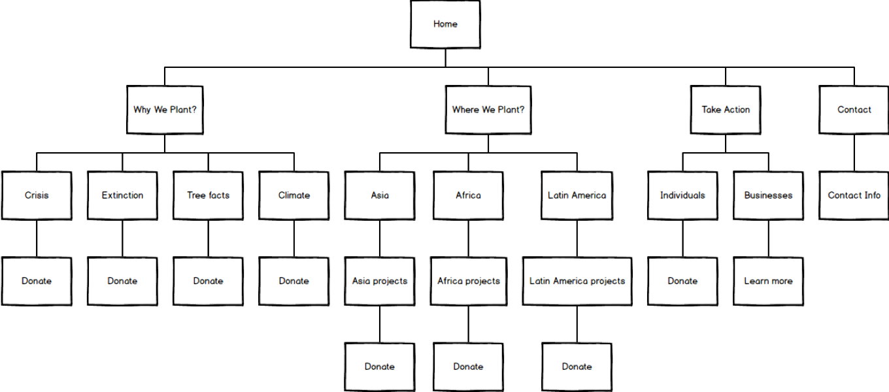

# # Wireframe
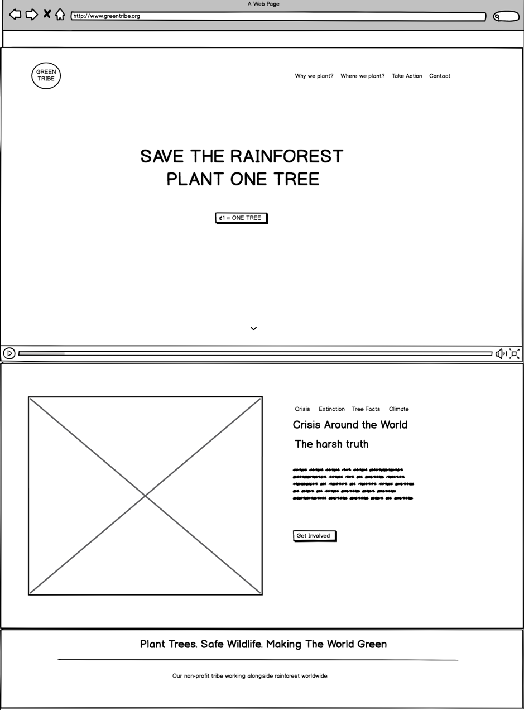
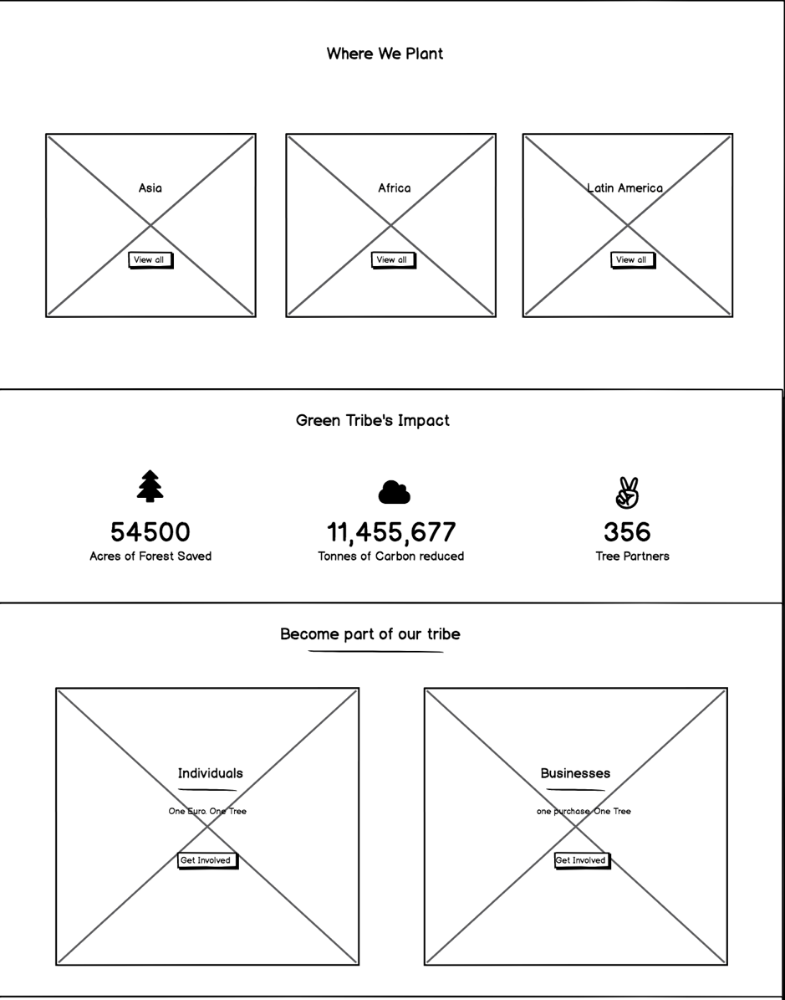
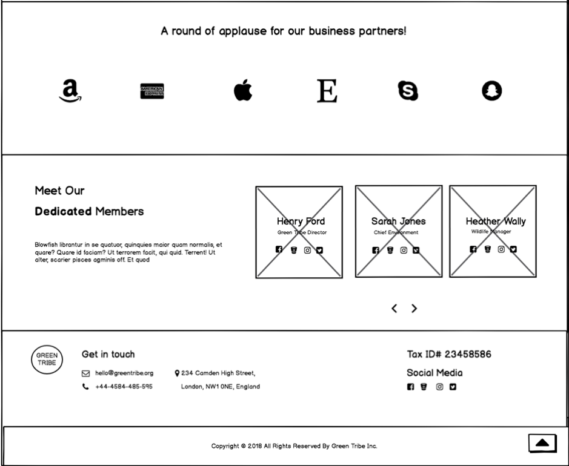

# #Search Engine Optimisation (SEO)
-	Priority keywords and phrases will be set out effectively as SEO and Google adwords are very important for online marketing campaign
-	Meta-tag
-	Some selected pre-existing priority keywords and phrases will be used with the majority being new ones added
-	Content editing will be done by the company and approve by the web development team with SEO in mind.

# Web Technologies Recommendations

# # Choice of URL:
URL should represent a sense of fun and unity. We should choose a “.org” URL to represent a non-profit organisation according to the goal of the company.
URL available is www.greentribe.org

# # Service Provider: 
To provide strong credibility and website security image to users, the scheme type of internet service will be “https”. The encryption makes sure that users’ information remains confidential from prying eyes on the internet and enhance users’ confidence via complete privacy control.  With website’s integrity enhanced, SEO optimisation will also be more effectively. We will use Bluehost service provider who is a reputable company offering encrypted hosting at a competitive price (Bluehost, 2018).

# # Technology Stack:
A static website which is easy to browse with added secure online payment options. This is a simple website requiring standard CMS software. We will also aim for low latency and highly responsive performance aspect. There should be an easy-to-manage CMS system for the client to conveniently update new content. 
Due to the expected growth of users in the future, the website must be able to handle horizontal scalability as the user number increases. The website should also be able to collect user information as a database for future development. 

# # Recommended technology stack is:
-	HTML5
-	CSS & Bootstrap
-	JavaScript & JQuery
-	React.js
-	Nginx
-	Python
-	Django
-	MySQL
-	Redis

# # Method of implementation:
This will start with structural design through wireframe and prototyping while gathering high quality media and text content followed by front-end and user-experience visual element design to comply with the branding goal. During this phase, we will use tools such as style tiles and mood board to support the process. Once this is satisfied, we will begin coding and testing phase and eventually host the website.  
In terms of file transfer protocol, we will choose a secure server for transfer files and backup data which supports proxies and encryption. It will have an easy-to-use interface. The recommended software is “Win SCP” which also comes in a portable edition.

# Implementation and Testing:
Main page consists of subsections, some are anchored to the navigation bar:
1.	 Home section (anchored to “Green Tribe” logo and “Home” navigation tab)
2.	Crisis section (anchored to “Why We Plant” navigation tab)
3.	Statement section (not anchored)
4.	Where-We-Plant section (anchored to “Where We Plant” navigation tab)
5.	Stats section (not anchored)
6.	Take-Action section (anchored to “Take Action” navigation tab)
7.	Business Client section (not anchored)
8.	Team section (not anchored)
9.	Contact section (anchored to “Contact” navigation tab)
10.	Footer section (not anchored)

# # Home Section:
Home section consists of logo, navigation bar, video media, and a call-to-action button “€1 = ONE TREE” which in the future will lead to an individual donation page with options for the amount of donation and integrated secured online payment options.
-	The GreenTribe logo on the left corner is fixed to the entire homepage which will be shown even if user scroll down to other part of the page. When click on the logo, user will be directed back to the home section.
-	The short video is an animation that effectively shows what the website is about. First the clip shows trees which then disappear reflecting the crisis of deforestation. 
-	The call-to-action button “€1 = ONE TREE” changes colour to orange background with white text when hovered on. 
-	The arrow-down button at the bottom of this section is anchored to the “Crisis section”. It changed to orange when hovered and will direct users to this section on the main page when clicked on. 
-	The navigation bar at the top also has a hover-on effect. Each tab changes colour from white to yellow when hovered on. In addition, when a user scrolls down and away from the “Home section”, the navigation bar will still show throughout the whole page with the background colour changed to white background. The navigation tab also changes colour to yellow indicating the section that the user is on. 

# # Crisis Section:
This is prioritised as the most important section of the whole webpage after the home page -we are showing immediate current effects of deforestation and reforestation. As a result, arrow-down anchored tag on the “Home page” direct users here instantly. 
This section has its own tabs including “Crisis”, “Extinction”, “Tree Facts”, “Climate”. Once clicks on each tab, users are directed to the information specific to that tab. The tab colour also changes to orange indicating the tab in use. 
There is also a call-to-action button “Get Involved”. In the future, this button will lead users to a webpage providing information on how to donate as an individual or as a business partner. The background colour of the call-to-action button changes colour to orange when hovered on.

# # Statement Section:
This section provides an accurate, brief, scannable mission of Green Tribe with rainforest background. The background is cover dark and transparent overlay in order to make the text easier to read. 

# # Where We Plant? Section
This section give users a better understanding of the main geography that we operate in worldwide including rainforests in Asia, Africa and South America. 
This section has 3 boxes with background pictures showing each continent. The background is with added image overlay to make it dimmer making the texts easier to read. Upon hovered on, each box changes to grey background. In addition, text box “View All” appear. This will, in the future, be linked to another webpage that shows photos and detail of past projects in each continent. 

# # Stats Section
This section shows the impacts that Green Tribe has create worldwide on different view including 
-	Acres of forest saved
-	Tonnes of carbon reduced
-	Numbers of business and charity partners worldwide
Each stat view as its own box with stat number that has a “number count-up effect” using jQuery. When hovered on, each box changes colour from green to yellow. Moreover, each icon moves up and also changes colour from white to yellow.

# # Take Action section:
To make the audience understand how they can support Green Tribe, this section is separated into 2 boxed – one for individuals and one for businesses. Each box has a brief explanation of how donation for each type works with transparent grey background for easy reading. 
When hovered on, each background changes to grey colour with “Get Involved” text box. In the future, each text box will be linked to another page with information on how individuals can support Green Tribe and how businesses can become our partners. 

# # Clients Section:
Shows major business partners that have been supporting us for more than 5 years. It provides credibility to the brand and formal reference.
The small left and right arrows act as a carousel to show all partners’ logos.

# # Team Section:
This allows user to learn more about our dedicated team behind the scene including their profiles and background.
Team section has a carousel with 6 boxes. Each box contains an image of a team member. There are small right and left arrows at the bottom of the carousel allowing users to scroll through all the team members.
When hovered on, the background for each box changes to transparent grey. The name and the role of the member appears along with social media links. In the future, these social media links will be linked to each team member’s social media profiles. When hovered on each social media link, the link changes colour to the brand colour of each social media platform. 

# # Contact Section:
The contact section provides all necessary contact information as well as tax ID number and Green Tribe’s social media links.
In the future, these social links will be links to Green Tribe’s social media profiles. When hovered on each social media link, the link changes colour to the brand colour of each social media platform.

# # Footer section:
This section shows the copyright info. We’ve also built a “back-to-top button” in this section on the right-hand side. When hovered on, the button changes colour to orange, and direct users back to home section when clicked on. Users are always able to see this button no matter where they are on the main page. 

# Test Log:
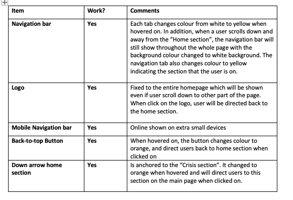
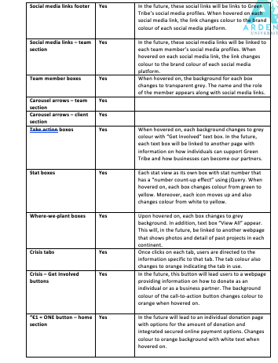

# Optimisation
# # Search Engine:
In order to enhance search engine optimisation for the website, we include appropriate meta tags with main keywords such as global warming, charity, endangered species, deforestation, climate change, wildlife etc (Lindblom 2012). The keywords will also be added in the content of the website. The anchor texts used for linking content on the must be useful and related. 
We will take advantage of Google Ad Grants for non-profit organisation to fund parts of the AdWords campaign (Halloran 2018). More extensive research for longtail keywords - using tools such as Google keyword suggestion - will be conducted for this campaign focusing on targeted advertising (Wallbeoff 2017). 
 We also make sure that the website meets the standard of W3C in accordance to the recommendation of HTML accessibility. Moreover, the website will be linked to social media profiles and content shared on social media platforms. All media and photos properly tagged with the inclusion of keyword phase and minimised for website loading performance. 

# Mobile Accessibility:
The website is built as a responsive website using Media Queries and Bootstrap extra small grid code for mobile viewport. This provides effective performance on all devices. The interface controls are accessible on both mobile and computer devices. Customised layouts are used for different devices for best result as well as image quality. Moreover, input forms including donation and payment are to be made as simple as possible.
Below are codes specific to mobile accessibility and responsive website

# # Responsive HTML
# # # HTML header adjustment:
Responsive.CSS style sheet was added to the header

# # # HTML body – Header adjustment:
Mobile opening and closing menus are included in the header which will be shown only when opened on extra small devices.

HTML body – “Crisis”, “Where We Plant”, “Stats”, “Take Action” and “Team” sections with adjustments:
Additional Bootstrap Grid classes were added for small and extra small devices.

HTML  Footer adjustment:
The “Back to Top” button is made to be hidden for small and extra small devices.

# # Responsive CSS:
Additional CSS file named “Responsive.CSS” with mobile menu design and Bootstrap Media Queries was added. 

# Advertising Revenue:
Advertising Revenue will come from providing brand packages for business partners
-	Brand logo to be included on the main webpage under “Our partners” section
-	An article included in a weekly email marketing and newsletter
-	A post on social media platform
-	Online events including the brand of the business partner on the online poster which will posted instead of the main slider on the homepage.

# Local Exposure:
To target local audience, we will list the website on google local business and google map. The keywords for the website will include longtail keywords and words indicating local areas such as Europe, London, United Kingdom, Camden, NW5, West London etc (Bonelli 2017). We also gather online reviews and list the website on local business directories. 
We will collaborate with local bloggers and online influencers to promote upcoming charity events. 

# Appendices:
Adidas, (2018), Adidas logo [ONLINE]. Available at: https://www.adidas.co.uk/ [Accessed 2 October 2018].

Alan Godfrey, (2018), Rainforest [ONLINE]. Available at: https://unsplash.com/photos/Nn7wQs4am7E[Accessed 1 October 2018].

Bluehost. 2018. The Best Web Hosting. [ONLINE] Available at: https://www.bluehost.com/. [Accessed 30 September 2018].

Bonelli, S, 2017. Local SEO in 2017: 5 simple ways to dominate local search. Search Engine Land, [Online]. 1, 1. Available at: https://searchengineland.com/local-seo-2017-5-simple-ways-dominate-local-search-268412 [Accessed 5 October 2018].

Casey Horner, (2018), Felton, United States [ONLINE]. Available at: https://unsplash.com/photos/4rDCa5hBlCs [Accessed 1 October 2018].

David Yanutama, (2018), Im cute [ONLINE]. Available at: https://unsplash.com/photos/WZdRnt-gaeU[Accessed 1 October 2018].

Disney Channel, (2018), Disney Channel logo [ONLINE]. Available at: https://en.wikipedia.org/wiki/Disney_Channel [Accessed 2 October 2018].

Fulvio Ambrosanio, (2018), Forest tree trunks [ONLINE]. Available at: https://unsplash.com/photos/yFBAzBCkjMs [Accessed 1 October 2018].

Halloran, K, 2018. Major Changes to Google Ad Grants: What Your Nonprofit Needs to Know. WordStream, [Online]. Available at: https://www.wordstream.com/blog/ws/2013/12/18/google-grants-adwords-for-nonprofits [Accessed 4 October 2018].

Housel, K, 2017. Truly Sustainable Brands Have These 3 Values In Common. The Good Trade, [Online]. Available at: http://www.thegoodtrade.com/features/3-brand-values-to-look-for-when-shopping-sustainably [Accessed 15 August 2018].

James Balensiefen, (2018), Bishop Arts District, Dallas, United States [ONLINE]. Available at: https://unsplash.com/photos/snFilgm4_RU [Accessed 1 October 2018].

Jean Wimmerlin, (2018), Kruger Park, South Africa [ONLINE]. Available at: https://unsplash.com/photos/r3rIAYSghTo [Accessed 1 October 2018].

Joseph Kelly, (2018), Threats to the Rain forest Motion Graphics Series [ONLINE]. Available at: https://www.shutterstock.com/video/clip-1008644167-threats-rain-forest-motion-graphics-series--[Accessed 3 October 2018].

Justin Veenema, (2018), Pitbull on a leash [ONLINE]. Available at: https://unsplash.com/photos/_c_I5GMZYR0 [Accessed 1 October 2018].

Lapetus Solutions, (2018), Lapetus Solutions logo [ONLINE]. Available at: https://www.lapetussolutions.com/ [Accessed 2 October 2018].

Lindblom, M, 2012. 5 Tips for Choosing Keywords for Your Nonprofit Website. Wired Impact, [Online]. Available at: https://wiredimpact.com/blog/keyword-tips-nonprofit-website/ [Accessed 4 October 2018].

Little House Brewing, (2018), Little House Brewing logo [ONLINE]. Available at: https://www.littlehousebrewing.com/ [Accessed 2 October 2018].

Michael Dam, (2018), Kolding, Denmark [ONLINE]. Available at: https://unsplash.com/photos/mEZ3PoFGs_k [Accessed 1 October 2018].

Minnesota, (2018), Minnesota logo [ONLINE]. Available at: https://mn.gov/portal/brand/style-guide/logo/[Accessed 2 October 2018].

Morris, S, 2007. The good wood guide: Eco-friendly options for furnishing your home. Independent, [Online]. Available at: https://www.independent.co.uk/environment/green-living/the-good-wood-guide-eco-friendly-options-for-furnishing-your-home-5333472.html [Accessed 15 August 2018].

Nasa, (2018), Yemen [ONLINE]. Available at: https://unsplash.com/photos/i9w4Uy1pU-s [Accessed 1 October 2018].

Perry Grone, (2018), Athens, Greece [ONLINE]. Available at: https://unsplash.com/photos/lbLgFFlADrY[Accessed 1 October 2018].

Preben Nilsen, (2018), Ha Giang, Vietnam [ONLINE]. Available at: https://unsplash.com/photos/CSrpmTrPP1s [Accessed 1 October 2018].

Sergey Pesterev, (2018), View of Kilimanjaro from Amboseli National Park, Kenya [ONLINE]. Available at: https://unsplash.com/photos/DWXR-nAbxCk [Accessed 1 October 2018].

Slava Bowman, (2018), Globe [ONLINE]. Available at: https://unsplash.com/photos/VVgVlH1D10U[Accessed 1 October 2018].

Sprout Social, (2018), Sprout social logo [ONLINE]. Available at: https://sproutsocial.com/ [Accessed 2 October 2018].

Svyatoslav Romanov, (2018), Mount Tamalpais, United States [ONLINE]. Available at: http://www.harvardgenerator.com/references/online-image [Accessed 1 October 2018].

Tobias Jelskov, (2018), Flamingo [ONLINE]. Available at: https://unsplash.com/photos/8rN1nveQ4Bc[Accessed 1 October 2018].

Wallbeoff, M, 2017. 4 Tips for Choosing Keywords for Your Google AdWords Campaign. Firefly Partners, [Online]. 1, 1. Available at: https://www.fireflypartners.com/communication/3-tips-for-choosing-keywords-for-your-google-adwords-campaign/ [Accessed 4 October 2018].

WWF. 2018. Forests | WWF. [ONLINE] Available at: https://www.wwf.org.uk/where-we-work/habitats/forests. [Accessed 15 August 2018].

# Appendix Table 1 & 2:

Cool Earth. 2018. The future of rainforest protection. [ONLINE] Available at: https://www.coolearth.org/. [Accessed 16 September 2018].

Global Canopy. 2018. We all rely on tropical forests. [ONLINE] Available at: http://www.globalcanopy.org/. [Accessed 16 September 2018].

One Tree Planted. 2018. We plant trees. [ONLINE] Available at: https://onetreeplanted.org/. [Accessed 16 September 2018].

Rainforest Action Network. 2015. We take action against the companies and industries driving deforestation and climate change.. [ONLINE] Available at: https://www.ran.org/. [Accessed 16 September 2018].

Rainforest Alliance. 1987. Working with you to rebalance the planet. [ONLINE] Available at: https://www.rainforest-alliance.org/. [Accessed 16 September 2018].

Rainforest Foundation UK. 2018. Securing lands and sustaining lives. [ONLINE] Available at: https://www.rainforestfoundationuk.org/. [Accessed 16 September 2018].

Rainforest Rescue. 2014. We are protecting threatened rainforest in Australia. [ONLINE] Available at: https://www.rainforestrescue.org.au/. [Accessed 16 September 2018].

Say No to Palm Oil. 2018. If it harms animal, people and our planet. [ONLINE] Available at: http://www.saynotopalmoil.com/. [Accessed 16 September 2018].

SOS. 2018. Sumatran Orangutan Society. [ONLINE] Available at: https://www.orangutans-sos.org/. [Accessed 16 September 2018].

World Land Trust. 2018. International Conservation Charity. [ONLINE] Available at: https://www.worldlandtrust.org/. [Accessed 16 September 2018].

